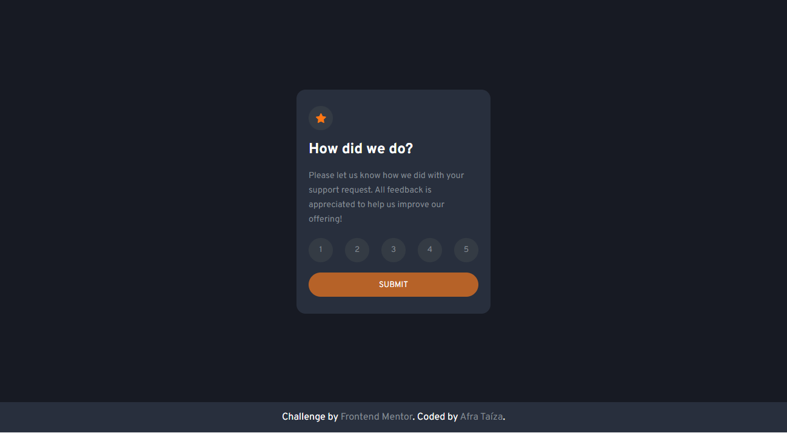
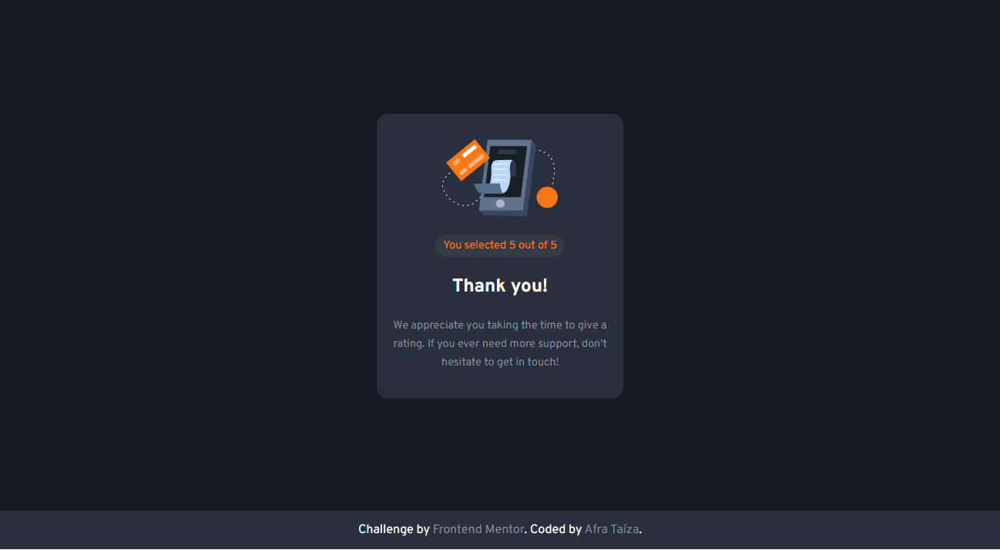

# Frontend Mentor - Interactive rating component Solução

Esta é a solução do desafio Frontend Mentor [Interactive rating component](https://www.frontendmentor.io/challenges/interactive-rating-component-koxpeBUmI). Os desafios do Frontend Mentor ajudam você a melhorar suas habilidades de codificação criando projetos realistas. 

## Índice

- [Visão geral](#visão)
  - [O Desafio](#o-desafio)
  - [Screenshot](#screenshot)
  - [Links](#links)
  - [Construído Com](#construído-com)
  - [O Que Aprendi ](#o-que-aprendi)
- [Author](#author)

## Visão Geral

Neste projeto foi desenvolvido um card de avaliação e um card de agradecimento. O card de avaliação é interativo, onde o usuário escolhe uma avaliação de 1 a 5, após escolher, o botão de envio é habilitado, ao enviar a classificação, um elemento de loading é carregado no botão, e após alguns segundos o usuário é redirecionado para o card de agradecimento. 

### O Desafio

Os usuários devem ser capazes de:

- Visualizar o layout ideal para o aplicativo, dependendo do tamanho da tela do dispositivo
- Visualizar os estados de foco para todos os elementos interativos na página
- Selecionar e enviar uma classificação numérica
- Visualizar o estado do cartão "Obrigado" após enviar uma avaliação

### Screenshot

### Links

- Demo URL: [Interactive Rating](https://your-live-site-url.com)

### Construído Com

- HTML5 Semântico
- CSS3
- Flexbox
- Mobile-first
- Javascript

### O Que Aprendi

Foi possível aperfeiçoar habilidades em recusos de animção CSS e colocar em prática habilidades em programção Javascript.

## Author

- Frontend Mentor - [@afrataiza](https://www.frontendmentor.io/profile/afrataiza)
- Linkedin - [@afrataiza](https://www.linkedin.com/in/afrataiza)
